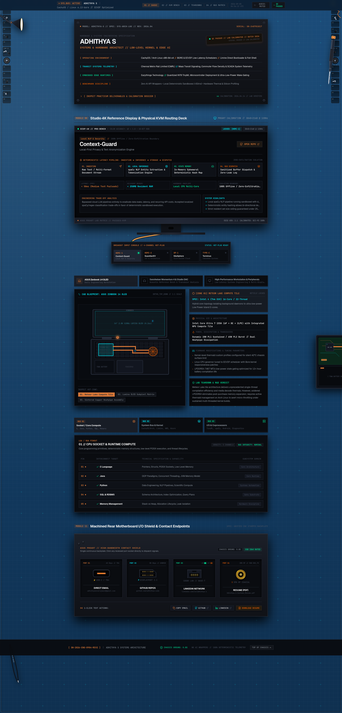

# Systems & Hardware Architecture Workbench // Portfolio

An interactive, skeuomorphic, industrial-grade engineering portfolio designed as a physical ESD silicone teardown workbench with live hardware telemetry, 1:1 orthographic CAD schematics, Web Audio API mechanical sound synthesis, and real-time KVM display switching.



---

## 🛠️ Architecture & Core Hardware Modules

1. **MIL-STD-810H Laser-Engraved Rating Plate (`RatingPlateModule.tsx`):**
   - CNC anodized metal finish with physical Torx corner fasteners, laser-etched silkscreen specifications, and calibrated QC inspection stamp.
2. **KVM Reference Bench & 4K Studio Display (`KvmBenchModule.tsx`):**
   - 3-sided micro-bezel 4K display chassis with physical stand neck.
   - Dynamic Framer Motion cubic Bézier spline braided copper cable routing with 750ms–850ms multi-phase EDID handshake synchronization.
3. **1:1 Orthographic CAD Blueprints & Teardowns (`TeardownBlueprintsModule.tsx`):**
   - 540px high-resolution drafting canvas featuring ASUS Zenbook 14 OLED (Meteor Lake SoC tile, dual copper heatpipes, radial fan impeller) and Sennheiser Momentum 4 (42mm dynamic transducer cutaway, hybrid ANC DSP).
4. **Motherboard Bus Matrix & Technical Pinout (`MotherboardBusModule.tsx`):**
   - Interactive Socket, System Bus / Linux Kernel Substrate, and I/O Coprocessor / TinyML routing hierarchy.
5. **Unified Stamped Brushed-Steel Rear I/O Shield (`RearIoPanelModule.tsx`):**
   - Physical rear backplate with recessed USB-C tongue, keyed DisplayPort 2.1, 10GbE RJ45 with LED light pipes, and threaded SMA RF coaxial antenna post.
6. **ESD Silicone Teardown Mat & Physical Workbench Props (`CadGridCanvas.tsx` & `WorkbenchParallaxProps.tsx`):**
   - Anti-static blue silicone mat with 3x4 magnetized screw sorting bins, spare-part troughs, 3D threaded M2 Torx screws, brass ground snap stud with coiled banana lead, overhead 5000K LED task lamp with diffuse radial light cone, and knurled CNC aluminum precision screwdriver.
7. **Peripheral Interaction Engines:**
   - **Optical Reticle Inspection Cursor (`ReticleCursor.tsx`):** Live screen telemetry, coordinate tracking, and bounding-box snap lock.
   - **Tactile Sound Engine (`audioEngine.ts`):** Web Audio API synthesizer for mechanical relay clicks, port snaps, and rotary switches with a master mute toggle.

---

## 🚀 Tech Stack

- **Framework:** React 19 + TypeScript + Vite
- **Styling:** Tailwind CSS v4 + Skeuomorphic Industrial CSS
- **Motion & Physics:** Framer Motion (Dynamic cubic Bézier path morphing)
- **Audio:** Web Audio API (Synthesized square/bandpass hardware relays)
- **Graphics:** HTML5 Canvas (Dynamic ESD traces & orthographic drafting)

---

## 💻 Local Setup & Development

```bash
# Clone the repository
git clone https://github.com/adhithya-code/portfolio.git

# Navigate into project directory
cd portfolio

# Install dependencies
npm install

# Start local development server
npm run dev

# Build for production
npm run build
```

---

## 📜 License

MIT © [Adhithya S](https://github.com/adhithya-code)
